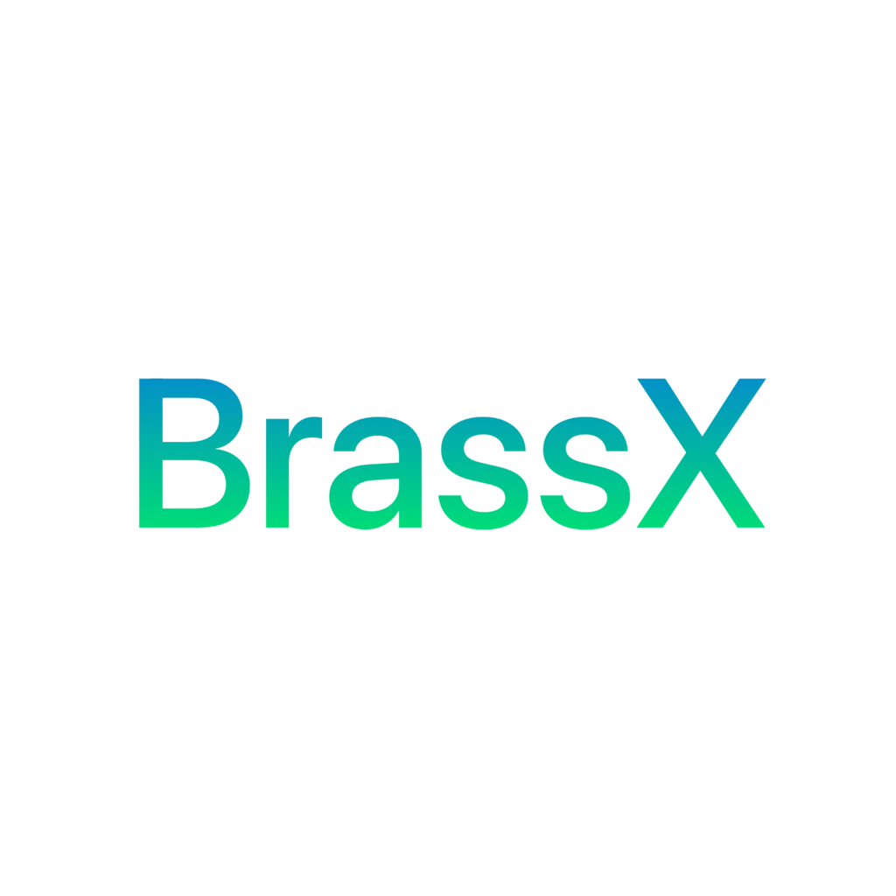

# Brass Excerpts

<!-- 

 -->

A React Native app that is a convenient pocket reference for orchestral excerpts, and auditions. This app contains all major brass excerpts, and current job listings, as well as information about the composers. There is also a function that allows the user to randomize excerpts, and save excerpts as favorites.

 <!-- available on the <a href="https://apps.apple.com/tt/app/scale-practice-randomizer/id1496727056">Apple App Store</a>, <a href="https://play.google.com/store/apps/details?id=com.scalepractice">Google Play Store</a>, and the <a href="https://www.amazon.com/dp/B08X6RNHRK/ref=sr_1_2">Amazon App Store</a>.  -->

## Requirements

- iOS 10.0+
- Xcode 14.0+

## Contributing

If you have feature requests or bug reports, feel free to help out by sending pull requests or by [creating new issues](https://github.com/aburdiss/BrassExcerpts/issues/new).

## License

"Brass Excerpts" is released under the MIT license. See [LICENSE](LICENSE) for details.
